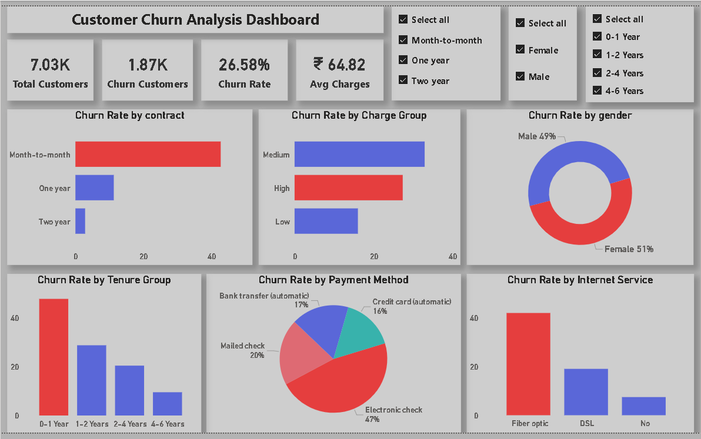

# Customer-Churn-Analysis-Prediction-Dashboard
End-to-end Customer Churn Analysis and Prediction project using SQL, Python, and Power BI. Includes data cleaning, transformation, exploratory data analysis, machine learning model (Logistic Regression), and an interactive dashboard to identify churn patterns and support business decision-making.

## Project Overview

This project focuses on analyzing customer churn data to understand why customers leave a service and how businesses can reduce churn. It covers the complete data analysis pipeline including data cleaning, transformation, exploratory data analysis, machine learning, and dashboard visualization.

---

## Objectives

* Identify key factors affecting customer churn
* Analyze customer behavior and patterns
* Build a machine learning model to predict churn
* Create an interactive dashboard for business insights

---

## Tools & Technologies

* **SQL** – Data querying, joins, and analysis
* **Python (Pandas, NumPy, Matplotlib, Scikit-learn)** – Data cleaning, transformation, EDA, and ML model
* **Microsoft Power BI** – Dashboard development and data visualization
* **Excel** – Initial data cleaning

---

## Key Analysis Performed

* Customer churn rate calculation
* Churn analysis by contract type, tenure, charges, and payment method
* Identification of high-risk customer segments
* Feature engineering and data transformation
* Machine learning model (Logistic Regression) for churn prediction

---

## Machine Learning

* Model: Logistic Regression
* Goal: Predict whether a customer will churn
* Input Features: Tenure, Monthly Charges, and other relevant variables
* Output:

  * `1` → Customer will churn
  * `0` → Customer will stay

---

## Dashboard Features

* KPI cards (Total Customers, Churn Customers, Churn Rate, Avg Charges)
* Churn analysis by:

  * Contract Type
  * Tenure Group
  * Charge Category
  * Payment Method
  * Internet Service
* Interactive filters (slicers)
* Highlighted high-risk segments using color coding

---

## Key Insights

* Month-to-month contracts have the highest churn
* Customers with 0–1 year tenure are more likely to churn
* Higher monthly charges increase churn probability
* Fiber optic users show higher churn rates

---

## Dashboard Preview

---

## Conclusion

This project demonstrates end-to-end data analysis and machine learning skills to solve a real-world business problem. The insights generated can help organizations reduce churn and improve customer retention strategies.

---

## Author

**Om Patil**

